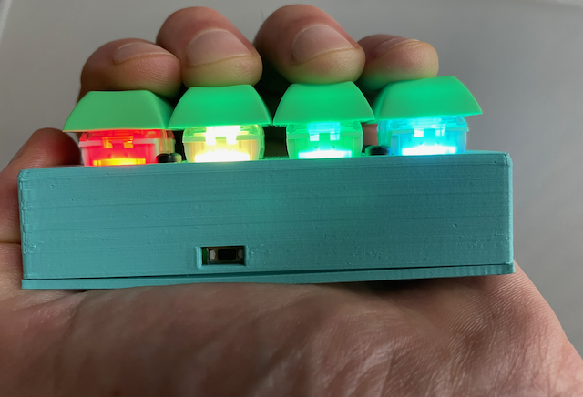

# ble-morsecode-neokey
Bluetooth One Hand Morse Code Keyboard

This wireless four key keyboard allows for typing on laptops, phones and tablets. This subtle interface is CircuitPython based. It uses morse code dots and dashes with a lookup table to translate characters.

<pre>
Features:

* Built-in USB-C charger
* 420mAh charger
* Wireless BLE v5.x
* Each key has a NeoPixel LED

* Key1: '.'    # dot
* Key2: '-'    # dash
* Key3: ' '    # will do a space between words or show the morse code buffer contents
* Key4: *SEND* # translates morse code sequence to ascii sends ascii over BLE
</pre>

The morse code to ascii character is from Crysknife's excellent [morsePico project](https://github.com/Crysknife007/morsePico/blob/main/code.py). 

Bill of Materials (main components):
* [Adafruit LED Glasses Driver - nRF52840](https://www.adafruit.com/product/5217)
* [NeoKey 1x4 QT I2C](https://www.adafruit.com/product/4980)
* [Lithium Ion Polymer Battery 420mAh](https://www.adafruit.com/product/4236)

Tested with Circuitpython 9. Design files are from FreeCAD with STL and STEP available. 

